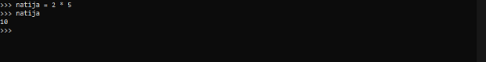

**Python o'zgaruvchisi nima?** 
  - Keling, o'zgaruvchi nima ekanligini rasmiyroq aniqlashdan boshlaylik:

**O'zgaruvchan**
  - O'zgaruvchidan keyinroq murojaat qilish mumkin bo'lgan ma'lumotlarni saqlash uchun foydalaniladi

> Demak, o‘zgaruvchi bu, masalan, hisob-kitob natijasini nomlash uchun foydalanadigan narsadir. Yoki, boshqacha qilib aytganda, biz o'sha hisoblash natijasini o'zgaruvchiga belgilashimiz mumkin. Biz cheksiz miqdordagi o'zgaruvchilarni yaratishimiz mumkin; biz ularga o'ziga xos nomlar berganimizga ishonch hosil qilishimiz kerak.

**Python o'zgaruvchisini e'lon qilish**
  - Birinchi o'rinda __REPL__-ni ochib olishim kerak
  	- ПУСК+R knoplarini bosish orqali  terminal (cmd)-ni ochib olamiz
  	  - agarda siz Python o'rnatgan bo'lsangiz oddiy **python** so'zini yozing va __Enter__-ni bosing

Biz REPLda chaqirilgan Python o'zgaruvchisini (rasmiy ravishda o'zgaruvchini e'lon qilish deb ataladi) natija yaratamiz. Ammo buni qilishdan oldin, biz Python qanday natija ekanligini bilishini tekshirib ko'ramiz:

> Python sizga xatolar haqida ma'lumot beradi. Birinchi ikkita qatorga e'tibor bermang va uning o'rniga haqiqiy xatoga e'tibor qarating. Python xabar beradi: name 'natija' is not defined. Python xatolar, agar siz qayerga qarashni bilsangiz, juda foydali bo'ladi. Shuning uchun men sizga bittasini ko'rsatmoqchi edim. Oxir-oqibat, siz o'zingiz kod yozishingiz kerak bo'ladi va xatolarga duch kelish, afsuski, ishning katta qismidir. Xatolarni shifrlash foydali mahorat bo'ladi!

Keling, o'zgaruvchining nomini e'lon qilamiz natija va unga qiymat berib sinab ko'raylik:

Bosqichma-bosqich shunday bo'ladi:
- Python topshiriq deb ataladigan narsani ko'radi: biz 2 * 5 natijasini chaqirilgan o'zgaruvchiga belgilaymiz natija. Topshiriqlar qulay tarzda “is” deb ataladigan “=” belgisi bilan bajariladi. Shunday qilib, biz Python-ga aytdik: men e'lon qilamanki natija, bu 2 * 5 ifodasining natijasidir.

- Keyinchalik, biz yozamiz natija.

- Python buni buyruq sifatida tan olmaydi, shuning uchun u bu nomga ega o'zgaruvchi bor yoki yo'qligini aniqlashga harakat qiladi. Bor va biz unga 10 tani tayinladik. Demak, bu chiziq ekranda chop etilgan 15 raqamiga baholanadi.

**O'zgaruvchilarni nomlash**

> Misolda biz umumiy nomni tanladik  natija, lekin siz o'zingizga mos deb hisoblagan har qanday nomni tanlashingiz mumkin. Umumiy qoida sifatida, har doim uning mazmunini eng yaxshi tavsiflovchi o'zgaruvchi nomini tanlang. Ushbu amaliyot sizning kodingizni yanada o'qilishi va tushunishni osonlashtiradi. Agar biz bu erda xarid qilish savatining umumiy narxini hisoblaganimizda, masalan, yaxshi nom bo'lar edi savdoning_umumiy_narxi.

> O'zgaruvchilar nomlaridagi belgilar sonini kamaytirmang. savdoning_umumiy_narxi kabi qisqartmalar o'rniga toza, o'qilishi mumkin bo'lgan ismlarga ega bo'lish yaxshiroqdir sun. Tez orada bilib olganingizdek, yaxshi kod muharriri oʻzgaruvchilar nomlari kabi narsalarni avtomatik tarzda toʻldiradi, shuning uchun agar sizni tashvishlantirayotgan boʻlsa, ularni toʻliq kiritishingiz shart emas.

**Ifodalarda o'zgaruvchilardan foydalanish**
  - Python o'zgaruvchilari tilning muhim qismidir, chunki siz ularni boshqa iboralarda ham ishlatishingiz mumkin:

Men iboralar so'zini ibora nima ekanligini tushuntirmasdan ishlatdim, keling, buni tuzatamiz:
> Ifoda
	Ifoda Python qiymat sifatida baholay oladigan har qanday narsadir

Bularning barchasi to'g'ri ifodalardir, chunki Python ularni qiymatga baholay oladi:

Yuqoridagi iboralarni ko'rgan narsa sharhlar deb ataladi. Xesh(#) belgisidan keyin kelgan har qanday narsa (#) Python sharhi sifatida ko'riladi va Python tarjimoni tomonidan e'tiborga olinmaydi.

**O'zgaruvchan turi**

> Aytgancha, o'zgaruvchiga tayinlangan qiymat raqam bo'lishi shart emas. Pythonda raqamlardan tashqari bir nechta ma'lumotlar turlari mavjud va ularning barchasi ifodaning natijasi (qiymati) bo'lishi mumkin. Bunday ma'lumotlar turlaridan biri Python satri bo'lib, bu tasodifan o'quv qo'llanmadagi keyingi maqolaning mavzusidir! Ammo mantiqiy va kortejlar kabi boshqalar ham bor ...

- Python o'rnatilgan funksiyaga ega bo'lib , type()biz o'zgaruvchi yoki ifoda turini aniqlash uchun foydalanishimiz mumkin. Mana bir nechta misollar:

- Birinchidan, biz qiymati 4 bo'lgan o'zgaruvchi yaratdik. So'ralganda, Python bizga bu o'zgaruvchi int sinfiga tegishli ekanligini aytadi, bu integer uchun qisqa . Agar xohlasangiz, butun sonlarni batafsilroq tushuntirish uchun havolaga o'ting.

- Keyinchalik, biz satr yaratamiz. Va so'ralganda, Python haqiqatan ham u str sinfiga tegishli ekanligini aytadi, string uchun qisqa. Python strings haqida ko'proq ma'lumot olish vaqti keldi , lekin men birinchi navbatda muhokama qilmoqchi bo'lgan oxirgi mavzu bor.

**Yaroqli Python o'zgaruvchilar nomlari**
  - O'zgaruvchilarni to'g'ri nomlash

> O'zgaruvchi nomida ba'zi belgilarga ruxsat berilmaydi; biz rioya qilishimiz kerak bo'lgan bir nechta qoidalar mavjud. O'zgaruvchi nomida paydo bo'lishi mumkin bo'lgan haqiqiy belgilarning to'liq ro'yxatidan boshlaylik:

- Kichik va katta harflar: az va AZ

- Raqamlar: 0-9

- Pastki chiziq: _

> Bundan tashqari, ikkita qoida mavjud :

- O'zgaruvchilar nomlari **harf** yoki **pastki chiziq belgisi** bilan boshlanishi kerak va **raqam bilan boshlanmasligi kerak**.

- Ismlar katta-kichik harflarga sezgir

> Mana ba'zi to'g'ri o'zgaruvchilar nomlari :

- ism_1

- ism_2

- yosh_1

- _bazaga_ulanish_uchun

> Bu noto'g'ri nomlar :

- 1ism (__raqam bilan boshlamang__)

- mening-raqamim (__- ruxsat berilmaydi__)

- mening raqamim (__bo'sh joylarga ruxsat berilmaydi__)

> Va bu o'zgaruvchilar bir xil emas, katta-kichik harf sezgirligi tufayli:

- ism

- ISM

- Yosh1

- yosh1